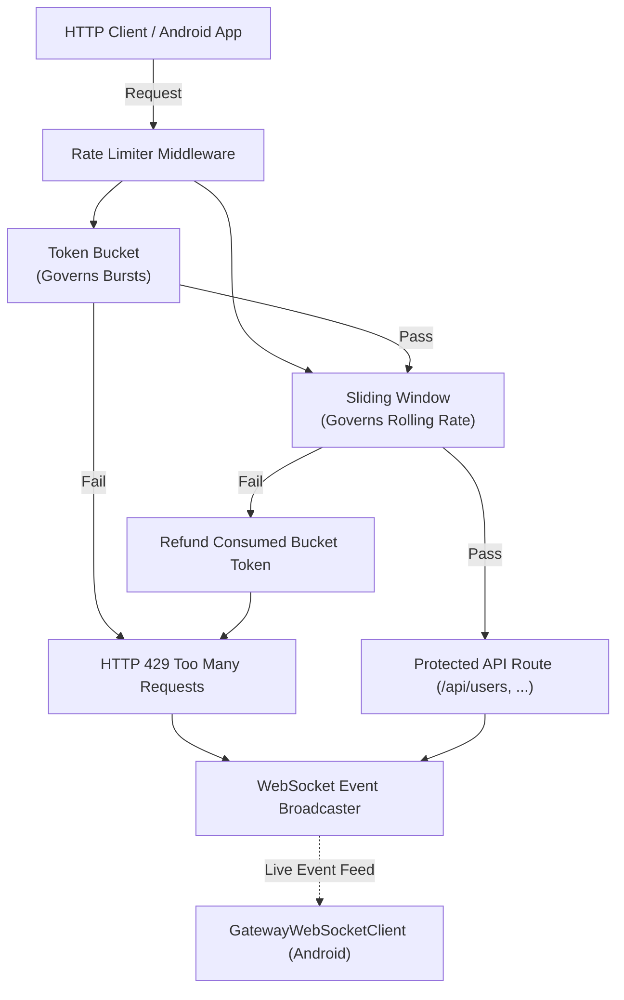

# NT14 Rate Limiter Gateway Backend (Kotlin / Ktor)

High-performance API rate limiter gateway and real-time telemetry service pairing with the **NT14 Android Optimizer Application**.

---

## Architecture & Algorithm Semantics

The gateway implements a dual-layer rate-limiting strategy evaluated with strict **AND** semantics:



### Algorithm Combination Logic (Decision 4a: AND)
- **Token Bucket**: Enforces burst tolerance up to bucket capacity and refills continuously at `limitPerMin / 60.0` tokens/second.
- **Sliding Window Counter**: Records timestamps over a rolling 60-second window to prevent boundary-clustering attacks.
- **Combination**: Every request must pass **both** algorithms. If the sliding window rejects, any token consumed from the bucket is refunded.
- **Response Headers**:
  - `X-RateLimit-Limit`: Maximum requests permitted per window.
  - `X-RateLimit-Remaining`: Remaining allowance before throttling.
  - `X-RateLimit-Reset`: Seconds until window resets.
  - `Retry-After`: Required backoff seconds returned on `429 Too Many Requests`.

---

## Authentication & Control-Plane Security (Decision 4b)

All state-mutating endpoints and telemetry streams require unified authentication using API Key `dev-local-key`:
- Supported via `X-API-Key` HTTP header or `?api_key=dev-local-key` query parameter.
- Unauthenticated requests to control-plane routes immediately return `401 Unauthorized`.

### API Routes Overview

| Method | Endpoint | Auth Required | Description |
|---|---|---|---|
| `GET` | `/health` | No | Gateway health and active subscriber count |
| `GET` | `/api/users` | No (Rate Limited) | Protected demo user directory |
| `GET` | `/api/orders` | No (Rate Limited) | Protected demo order directory |
| `GET` | `/api/products` | No (Rate Limited) | Protected demo product catalog |
| `GET` | `/api/rules` | **Yes** (`dev-local-key`) | Retrieve all active rate limit rules |
| `POST` | `/api/rules` | **Yes** (`dev-local-key`) | Create or update dynamic rate limit rule |
| `DELETE` | `/api/rules/{endpoint}` | **Yes** (`dev-local-key`) | Delete or reset endpoint rule |
| `POST` | `/api/simulate` | **Yes** (`dev-local-key`) | Inject simulated traffic burst |
| `WS` | `/ws/events` | **Yes** (`dev-local-key`) | Real-time telemetry feed |

---

## Quick Start & Running the Server

### 1. Prerequisites
- JDK 17 or higher (Gradle wrapper included).
- Port `8000` available on localhost.

### 2. Start the Gateway Server
```powershell
# From root repository directory:
.\gradlew.bat :gateway_server:run
```
The server will start and bind to `http://0.0.0.0:8000`.

### 3. Run Unit Tests
```powershell
.\gradlew.bat :gateway_server:test
```

### 4. Run CLI Traffic Simulator
```powershell
# Default test sequence (WebSocket listener + normal traffic + burst attack):
.\gradlew.bat :gateway_server:runSimulate

# Or pass specific modes:
.\gradlew.bat :gateway_server:runSimulate --args="normal"
.\gradlew.bat :gateway_server:runSimulate --args="burst"
.\gradlew.bat :gateway_server:runSimulate --args="listen"
```

---

## Connecting from Android App (Emulator & Device)

The Android application (`com.cutm.nt14`) contains a pre-configured WebSocket client (`GatewayWebSocketClient.kt`):

```kotlin
// Android Emulator -> Host Machine loopback bridge
private val serverWsUrl = "ws://10.0.2.2:8000/ws/events?api_key=dev-local-key"
```

- **Android Emulator**: Uses `10.0.2.2:8000` automatically mapped to host `localhost:8000`.
- **Physical Device**: Replace `10.0.2.2` with your machine's local LAN IP (e.g. `192.168.1.x:8000`).

### Telemetry Event Schema
Every request and security breach emits a byte-for-byte JSON payload:
```json
{
  "type": "request" | "blocked_request" | "ip_blocked",
  "ip": "192.168.1.50",
  "endpoint": "/api/users",
  "status": 200,
  "latency_ms": 24,
  "timestamp": 1727459100.123
}
```
When `type` is `"ip_blocked"` or `"blocked_request"`, the Android application automatically inserts records into `AbuseEventDao` and triggers a high-priority heads-up security notification.

---

## Known Limitations

- **In-Memory State**: Rate limits, token buckets, and request sliding windows are stored in memory (`ConcurrentHashMap`). State resets upon gateway restart and is not shared across distributed server instances. (Production deployments would back this with a Redis cluster).
- **Plain HTTP / WS (No TLS)**: The service operates over cleartext HTTP and WS. It is designed for local development and Android emulator loopback bridge (`10.0.2.2`), not direct internet exposure without a reverse proxy terminating TLS (such as Nginx, Cloudflare, or Envoy).
